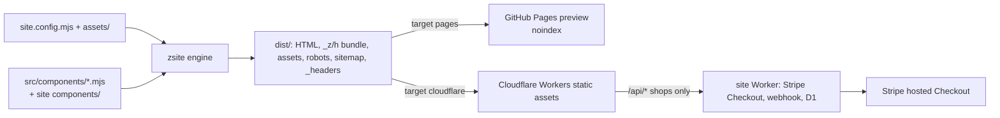

# Architecture

## Principles

- **Static first.** Every site is prebuilt HTML plus one hashed CSS bundle and one hashed JS bundle. Nothing runs on a server unless the site needs `/api/*` (shop checkout).
- **One source of truth per fact.** Content lives in `site.config.mjs`. Components derive HTML, JSON-LD (FAQPage, Product, Organization), the sitemap and meta tags from the same data. `car_website` copied dates and URLs into up to 7 places; this design avoids that.
- **Zero runtime dependencies** in `src/`. The only optional dependency is `sharp`, for responsive WebP variants. Without it, images are copied unchanged and the build warns.
- **Relative URLs everywhere.** `ctx.url("/about/")` is rewritten to a path relative to the current page. The same `dist/` works on `https://org.github.io/repo/` and at a domain root. The 404 page is the only exception: it is served at any depth, so it uses the target's base path.
- **Targets, not branches.** `local`, `pages` and `cloudflare` differ only in site URL, indexing, banner and extra files (see [DEPLOY.md](DEPLOY.md)).

## Engine (`src/`)

| File | Role |
|---|---|
| `config.mjs` | Loads `site.config.mjs`, normalises it and validates it against each component's `props`: unknown types, missing required props, bad paths, duplicate ids, unsafe theme tokens. |
| `components.mjs` | Auto-discovers `src/components/*.mjs` and `<site>/components/*.mjs`. Site components override framework ones of the same type. |
| `build.mjs` | Pass 1 renders page bodies and records the components, client scripts, icons and JSON-LD each page uses. The bundles then contain only CSS/JS for components actually used. Pass 2 assembles documents. Also runs the link checker. |
| `head.mjs` | Title, description, canonical, OG/Twitter tags, robots, favicon (generated from the brand initial if none is given), Google Fonts and the JSON-LD `@graph`. |
| `layout.mjs` | Skip link, preview banner, sticky nav with a CSS-only burger menu (and a basket link for shops), footer with sponsors and credit. |
| `assets.mjs` | Copies `assets/`. Makes 480/960/1600 px WebP variants with a content-keyed cache in `.zsite-cache/`. Records intrinsic sizes for `width`/`height`, so there is no layout shift. Enforces the 25 MiB limit. |
| `targets.mjs` | `robots.txt`, `sitemap.xml`, `_headers` (security headers, immutable `/_z/h/*`), `_redirects`. |
| `dev-server.mjs` | Rebuilds in a child process on any change, so there are no stale ESM caches, and live-reloads over SSE. |
| `themes.mjs` | Token presets: `classic` (CAR), `heritage` (Ardleevan), `midnight` (zagware.io), `plain`. |

## Components

A component is one `.mjs` file with an optional `.css` file beside it. See [COMPONENTS.md](COMPONENTS.md) for the contract and the full list. The devtest `/components/` page renders every component's `example` automatically, so a new component is visually checked on both targets before any customer site uses it.

Customer-specific sections live in `<site>/components/`. If one turns out to be generally useful, promote it into the framework.

## Commerce

See [COMMERCE.md](COMMERCE.md) for the tier recommendation, and [MEDUSA.md](MEDUSA.md) for the Medusa evaluation and local stack.
