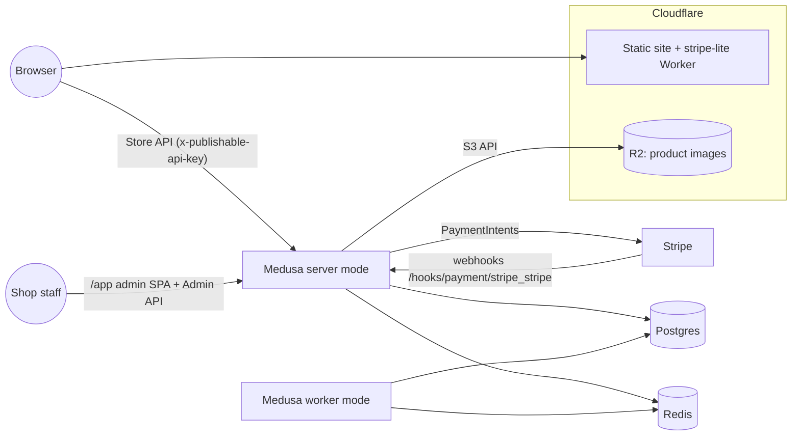

# Medusa v2 for Zagware — evaluation

Status: evaluated 2026-09-23 against Medusa **2.18.0** (the version pinned by the official
`medusa-starter-default`; upstream is already at 2.21.1). Runbook and reproducible stack:
[`infra/medusa/`](../infra/medusa/README.md).

## TL;DR

- **Default to stripe-lite.** For the typical Zagware shop (tens of products, simple options,
  owner happy to see orders in the Stripe Dashboard) the static catalogue + Stripe Checkout Worker
  costs ~$0 extra per customer and has nothing to patch. Medusa adds $2–66/month of hosting per
  customer depending on where it runs (shared VPS → Render/Cloudflare), plus a recurring
  upgrade/backup/monitoring chore that is the larger real cost.
- **Medusa is worth it** when a customer needs a real back office: inventory and stock locations,
  customer accounts and order history, returns/exchanges, promotions, price lists, multi-region
  tax/currency, or a catalogue large/volatile enough that editing site config per product change
  is unreasonable — *and* the shop's margin can carry roughly £30–60/month plus setup.
- **Host Medusa on a container host, not on Cloudflare.** Workers cannot run it. Cloudflare
  Containers can, but a 4 GiB always-on instance plus the external Postgres/Redis it needs costs
  ~$58/month per store, and scale-to-zero trades that for ~24-second cold starts (measured at ½ vCPU) on the
  first cart action. One Medusa per customer on a shared Hetzner VPS (Docker Compose, shared
  Postgres/Redis) is ~$2–6/store/month but makes us the ops team; Railway (~$5–8/store usage) is
  the managed middle ground. The storefront itself stays static on Cloudflare in every case.

## What was built and measured

`infra/medusa/` runs the official starter (Medusa 2.18.0, Node 22 Alpine) with Postgres 16 and
Redis 7 via Docker Compose, Redis-backed caching / event bus / workflow engine / locking modules,
optional Stripe provider, and CORS for the zsite dev server on `:4173`. `scripts/smoke.sh`
drives the Store API from product listing through cart, line item, shipping, payment session and
cart completion to an order (output in the README). Host: MacBook Pro i7-9750H, Docker Desktop VM
with 12 CPUs / 8 GiB.

| Metric | Result | How |
| --- | --- | --- |
| Image size | 554 MB uncompressed, 135 MB gzipped | `docker image inspect`; `docker save \| gzip` |
| Image build, cold cache | 219 s (178 s rebuild + restart after a config change) | `docker compose build` incl. base-image pulls, `yarn install`, `medusa build` (server + admin), production-only install |
| First boot on an empty database → healthy | 40.2 s | all module migrations, link sync, data-migration scripts, then `medusa start` |
| Seed + admin user + key (`bootstrap.sh`) | 22.7 s | starter seed: 1 region, 4 products, stock, shipping, publishable key |
| Restart → healthy, host CPUs | 23.1 s with the `db:migrate` check, **8.0 s** without | `docker compose start` → `GET /health` 200 (`scripts/measure.sh`) |
| Restart → healthy, ½ vCPU / 4 GiB (standard-1 emulation) | 70.2 s with `db:migrate`, **24.1 s** without | same, `docker update --cpus 0.5 --memory 4g` |
| Restart → healthy, ¼ vCPU / 1 GiB (basic emulation) | **60.8 s** without `db:migrate`; no OOM | `--cpus 0.25 --memory 1g` |
| Idle RAM, Medusa | 235 MiB (host), 272–274 MiB (½ vCPU), 244 MiB (1 GiB cap) | `docker stats --no-stream`, 30 s after healthy |
| RAM after 7 completed checkouts | 314 MiB | after 6 more `smoke.sh` runs |
| Idle RAM, Postgres / Redis | 79 MiB / 11 MiB (105 MiB Postgres after the checkouts) | `docker stats` |
| Idle CPU, Medusa | 0.01–0.04% of one core | `docker stats` |
| Redis traffic at idle | 422 commands/min ≈ 7/s over 13 connections | `INFO stats` delta over 60 s |
| Database size | 19 MB (seed + 7 orders) | `pg_database_size` |

CPU caps are CFS quotas on a laptop core, so the ½ and ¼ vCPU numbers approximate, not
reproduce, Cloudflare's instance types.

## Architecture

- **Medusa application** — one Node/Express process per instance. `workerMode: shared` serves
  the HTTP API *and* runs background work; production splits it into a `server` instance (Store
  API, Admin API, admin SPA at `/app`) and a `worker` instance (subscribers, scheduled jobs,
  long-running workflow steps). Same image, different `MEDUSA_WORKER_MODE`
  ([worker mode](https://docs.medusajs.com/learn/production/worker-mode)). Medusa's deployment
  guide asks for **at least 2 GB of RAM** on the hosting plan
  ([general deployment](https://docs.medusajs.com/learn/deployment/general)).
- **Postgres** — all commerce data (products, prices, inventory, carts, orders, customers, users,
  API keys). Migrations (`medusa db:migrate`, which also syncs module links and runs data
  migration scripts) must run on every upgrade before the new server starts.
- **Redis** — sessions, the Caching module, the Event Bus (BullMQ queues), the Workflow Engine
  (durable workflow state) and the Locking provider. The deployment guide lists all four Redis
  modules as the production setup. Redis is chatty even at idle: we measured
  **~7 commands/second** with no traffic (queue/workflow polling [INFERENCE]), which matters for per-command pricing.
- **File storage** — the default Local File provider writes to the container's disk; production
  uses the S3 provider, which supports Cloudflare R2
  ([S3 file provider](https://docs.medusajs.com/resources/infrastructure-modules/file/s3)).
- **Payments** — `@medusajs/medusa/payment-stripe` (PaymentIntents; storefront confirms with
  Stripe.js) configured with one secret key per Medusa instance and a webhook per provider at
  `/hooks/payment/stripe_stripe`
  ([Stripe provider](https://docs.medusajs.com/resources/commerce-modules/payment/payment-provider/stripe)).
  Our config only registers it when `STRIPE_API_KEY` is set, so the stack boots without keys and
  falls back to the manual `pp_system_default` provider.
- **Storefront integration** — the publishable API key is public and scopes requests to a sales
  channel; `STORE_CORS` must list every storefront origin. A static zsite can keep rendering the
  catalogue at build time (fetching `/store/products`) and call the Store API from the browser
  only for cart/checkout, so the backend is only on the purchase path.

## What can and cannot run on Cloudflare

| Piece | On Cloudflare? | Notes |
| --- | --- | --- |
| Static storefront, stripe-lite Worker | Yes (today) | Workers static assets + Worker API |
| Medusa on **Workers** | **No** | 128 MB memory per isolate, 64 MiB bundle limit, 1 s startup ([Workers limits](https://developers.cloudflare.com/workers/platform/limits/)); Medusa is a long-lived Node/Express server holding Postgres pools and Redis/BullMQ connections, and our 554 MB image is almost entirely production `node_modules`. |
| Medusa on **Containers** | Yes, with caveats | GA since 2026-04-13 ([changelog](https://developers.cloudflare.com/changelog/post/2026-04-13-containers-sandbox-ga/)). Image must be `linux/amd64` and fit the instance disk (ours: 554 MB). Only **standard-1** (½ vCPU, 4 GiB, 8 GB) meets Medusa's 2 GB guidance; **basic** (¼ vCPU, 1 GiB) boots and idles (see measurements) but has no headroom; **lite** (256 MiB) is below our idle RSS ([instance types](https://developers.cloudflare.com/containers/platform/limits/)). |
| Postgres | **External** | Container disk is ephemeral ("fresh disk as defined by its container image" after sleep, [FAQ](https://developers.cloudflare.com/containers/faq/)). Use Neon, Supabase or PlanetScale Postgres; set `DATABASE_SSL=true`. **Hyperdrive** pools/caches Postgres for *Workers* code ([Hyperdrive](https://developers.cloudflare.com/hyperdrive/)); a container connects with its own `pg` driver over normal TCP egress, and container outbound handlers only intercept HTTP(S) ([outbound traffic](https://developers.cloudflare.com/containers/guides/outbound-traffic/)), so Hyperdrive only helps if we add Worker-side reads (e.g. a cached catalogue endpoint). [INFERENCE from those two docs] |
| Redis | **External** | Upstash (TLS `rediss://`). Use a Fixed plan: at the measured ~7 idle commands/s, pay-as-you-go would be ~$36/month (see costs). |
| Files | R2 | S3 provider with R2 endpoint, custom domain for public URLs. |
| Worker mode | Awkward | Scheduled jobs and subscribers only run while an instance is awake. A `worker` container must be kept up (no scale-to-zero), or scheduled jobs moved to Cron Triggers that wake it. |

Container behaviour that matters for a shop backend
([lifecycle](https://developers.cloudflare.com/containers/concepts/architecture/),
[FAQ](https://developers.cloudflare.com/containers/faq/)):

- Every request goes Worker → Durable Object → container; `sleepAfter` defaults to **10 minutes**
  of inactivity, after which the next request cold-starts the container. Cloudflare quotes 1–3 s
  for typical images, "dependent on image size and code execution time": Medusa's own boot
  dominates — we measured **24.1 s** from start to healthy at ½ vCPU without migrations
  (**70.2 s** if the entrypoint also runs `db:migrate`; 8.0 s on unthrottled laptop cores).
- No guaranteed runtime: host restarts stop instances (SIGTERM, up to 15 min grace) and a restarted
  instance may land in a different location. No built-in autoscaling yet (`getRandom` over a fixed
  set of instances). Logs retained 7 days on paid plans.
- No swap; OOM restarts the instance.

## Monthly cost per customer

Assumptions: USD, excl. VAT; 30-day month = 720 h = 2,592,000 s; small shop (≤ a few hundred
orders/month, < 1 GB database, < 10 GB images); Stripe processing fees are identical in every
option and excluded. Measured Medusa footprint: RSS 235–314 MiB, idle CPU ≈ 0.04% of one core.

### (a) Cloudflare Containers, standard-1 (½ vCPU, 4 GiB, 8 GB disk)

Rates ([pricing](https://developers.cloudflare.com/containers/platform/pricing/)): memory
$0.0000025/GiB-s and disk $0.00000007/GB-s on **provisioned** size while running; CPU
$0.000020/vCPU-s on **active** use. Workers Paid ($5/month) includes 25 GiB-h (90,000 GiB-s)
memory, 375 vCPU-min (22,500 vCPU-s) and 200 GB-h (720,000 GB-s) disk **per account**, so they
offset only the first store; the marginal columns below ignore them.

**Always on** (one `shared` container, 2,592,000 s):

| Line | Arithmetic | First store | Each extra store |
| --- | --- | ---: | ---: |
| Memory | 4 GiB × 2,592,000 s = 10,368,000 GiB-s; first: (10,368,000 − 90,000) × $0.0000025 | $25.70 | $25.92 |
| Disk | 8 GB × 2,592,000 s = 20,736,000 GB-s; first: (20,736,000 − 720,000) × $0.00000007 | $1.40 | $1.45 |
| CPU | assume 2% of a vCPU average incl. traffic: 0.02 × 2,592,000 = 51,840 vCPU-s; first: (51,840 − 22,500) × $0.00002 | $0.59 | $1.04 |
| Workers Paid plan | account-wide | $5.00 | — |
| **Container subtotal** | | **$32.69** | **$28.41** |

CPU is the elastic part: fully busy (½ vCPU × 2,592,000 s = 1,296,000 vCPU-s) it would add
$25.92. The production split (server + always-on worker on `basic`: 1 GiB × 2,592,000 s ×
$0.0000025 = $6.48, plus 4 GB × 2,592,000 × $0.00000007 = $0.73) adds **$7.21**.

**Sleeping** (`sleepAfter` 10 min; billed only while awake): per awake hour
4 GiB × 3,600 s × $0.0000025 = $0.036 memory + 8 GB × 3,600 × $0.00000007 = $0.002 disk
= **$0.038/h** + CPU.

| Awake hours / month | Memory + disk | CPU (5% of a vCPU while awake) | Container |
| --- | --- | --- | ---: |
| 60 h (≈2 h/day) | 60 × $0.038 = $2.28 | 0.05 × 216,000 s × $0.00002 = $0.22 | ≈ $2.50 |
| 240 h (≈8 h/day) | 240 × $0.038 = $9.12 | 0.05 × 864,000 s × $0.00002 = $0.86 | ≈ $9.98 |
| 720 h (never idle 10 min) | = always on | | ≈ $28.41 |

Awake hours are set by traffic, not by the owner: one Store API call every 10 minutes (a shopper,
a crawler hitting a page that calls the API, an uptime probe, a Stripe webhook) keeps it awake.
[INFERENCE] A shop with visitors spread over the day will sit much closer to 720 h than to 60 h.

**External services the container needs** (per store):

| Service | Arithmetic | Always on | Sleeping 240 h |
| --- | --- | ---: | ---: |
| Neon Launch Postgres ([pricing](https://neon.com/pricing)) | 0.25 CU × 720 h = 180 CU-h × $0.106 = $19.08, + 0.5 GB (assumed; measured 19 MB) × $0.35 = $0.18. Medusa's open pool keeps compute awake while the container is up; Neon scales to zero after 5 min once it sleeps [INFERENCE]. Sleeping: 0.25 × 240 = 60 CU-h × $0.106 = $6.36 + $0.18 | $19.26 | $6.54 |
| *Alternative, not in total:* Supabase Pro ([pricing](https://supabase.com/pricing)) | $25/org/month incl. $10 compute credit (one Micro, 1 GB); each further store's project adds $10 Micro compute; never pauses | $10 (+$25 org) | $10 (+$25 org) |
| Upstash Redis ([pricing](https://upstash.com/pricing/redis)) | Fixed 250 MB = $10 flat. Pay-as-you-go would be 7.03 cmd/s × 2,592,000 s = 18.2 M commands × $0.20/100 K = **$36.45** idle | $10.00 | $10.00 |
| R2 images ([pricing](https://developers.cloudflare.com/r2/pricing/)) | < 10 GB and < 1 M writes: account free tier; beyond, $0.015/GB-month | $0 | $0 |
| Durable Object per container ([pricing](https://developers.cloudflare.com/durable-objects/platform/pricing/)) | worst case active all month: 2,592,000 s × 0.125 GB = 324,000 GB-s — inside the 400,000 GB-s account allowance for one store, $4.05 for each further store at $12.50/M GB-s [INFERENCE: docs do not say whether a container's DO bills duration while the container runs] | $0–4.05 | $0–1.35 |

| Cloudflare total per store | Always on | Sleeping 240 h |
| --- | ---: | ---: |
| Container + Neon + Upstash (+ DO) | **$57.67** (+≤$4) | **$26.52** (+≤$1.35) |

Neon's Free plan (100 CU-h/project, 0.5 GB) would cover a sleeping POC (60 CU-h), not a
production shop (no SLA, 0.5 GB cap).

### (b) One shared VPS (Hetzner) running several stores with Docker Compose

Prices after the 15 June 2026 adjustment, Germany/Finland, excl. VAT
([Hetzner price list](https://docs.hetzner.com/general/infrastructure-and-availability/price-adjustment/)):
CX33 (4 shared vCPU, 8 GB) €8.49; CX43 (8 vCPU, 16 GB) €15.99; backups +20% of the server price
([Hetzner billing FAQ](https://docs.hetzner.com/cloud/billing/faq/)); instance specs and the
€0.50/month primary IPv4 per the third-party calculator [costgoat](https://costgoat.com/pricing/hetzner). The shared-vCPU
line was shown as "currently not available" on hetzner.com at the time of writing; order
availability varies by location.

Layout: one Medusa container per customer (own database, own admin, own Stripe keys), one shared
Postgres 16 server with a database per store, one shared Redis with a logical DB (`/N`) per store,
Caddy for TLS. Images are built in CI and pulled: the image build (server + admin bundle) took
~3.5 min on a 12-core laptop and should not compete with live stores for CPU.

| Line | Arithmetic | Monthly |
| --- | --- | ---: |
| CX43 + backups + IPv4 | €15.99 + €3.20 + €0.50 | €19.69 (≈ $22.8) |
| Capacity | 16 GB − ~2 GB (OS, Postgres, Redis, Caddy) = 14 GB; budget 1 GB per store (measured RSS 235–314 MiB + headroom) | ~10–14 stores |
| **Per store at 10 stores** | €19.69 / 10 | **≈ €1.97 (≈ $2.30)** |
| Per store at 4 stores | €19.69 / 4 | ≈ €4.92 (≈ $5.70) |
| Off-site `pg_dump` to R2 | a few MB per store per night | ≈ $0 |

Smallest sensible start: CX33 (8 GB) at €8.49 + €1.70 + €0.50 = €10.69 for up to ~5 stores.
Trade-offs: a single machine is a shared failure domain, no autoscaling, and all patching,
monitoring and restores are ours.

### (c) Managed PaaS: Railway / Render

**Railway** ([pricing](https://railway.com/pricing)) bills *actual* usage per second: memory
$10/GB-month, CPU $20/vCPU-month, volumes $0.15/GB-month; Pro is $20/workspace/month including
$20 of usage.

| Service | Arithmetic | Monthly |
| --- | --- | ---: |
| Medusa (shared mode) | ~0.3 GB × $10 = $3.00; CPU 0.02 vCPU × $20 = $0.40 | $3.40 |
| Postgres | ~0.1 GB × $10 = $1.00; 1 GB volume × $0.15 | $1.15 |
| Redis | ~0.011 GB × $10 | $0.11 |
| **Per store** | (+$3 for a separate worker service) | **≈ $4.66 (≈ $7.7 split)** |

The $20 Pro credit absorbs the first ~4 stores; egress is $0.05/GB.

**Render** ([pricing](https://render.com/pricing)) bills provisioned instances:

| Service | Plan | Monthly |
| --- | --- | ---: |
| Medusa web service | Standard (2 GB, 1 CPU) — the smallest that meets the 2 GB guidance | $25 |
| Postgres | Basic-256mb | $6 |
| Key Value (Redis) | Starter 256 MB | $10 |
| **Per store** | (+$25 Standard background worker for the split) | **$41 ($66 split)** |

Plus the workspace plan (Hobby $0 / Pro $25) shared across customers.

For reference, **Medusa Cloud** ([pricing](https://medusajs.com/pricing/)) starts at $29/month
(Develop: one shared server, no storefront custom domains, no managed Redis) and $99/month
(Launch: production infrastructure, backups) per project.

### Summary

| Option | Per store / month | Cold starts | Who operates it |
| --- | ---: | --- | --- |
| stripe-lite (static site + Worker + Stripe Checkout) | ≈ $0 (inside the shared $5 Workers Paid plan) | none | Cloudflare |
| Hetzner shared VPS, 10 stores on a CX43 | ≈ $2.30 | none | **us** |
| Railway | ≈ $5–8 | none | Railway (we own upgrades) |
| Cloudflare Containers standard-1, sleeping 240 h | ≈ $27 | **~24 s** after 10 min idle | Cloudflare + Neon + Upstash (we own upgrades) |
| Render | $41–66 | none | Render (we own upgrades) |
| Cloudflare Containers standard-1, always on | ≈ $58 | none | Cloudflare + Neon + Upstash (we own upgrades) |
| Medusa Cloud | $29–99+ | none | Medusa (we own app upgrades) |

## Multi-tenancy: one Medusa per customer vs a shared instance

Medusa's own docs: "Medusa doesn't natively support multi-tenancy"; the Store module can hold
several stores but linking products, customers and orders to a store is custom work
([Store module](https://docs.medusajs.com/resources/commerce-modules/store)).

| Concern | One instance per customer | One shared instance |
| --- | --- | --- |
| Admin isolation | Each customer gets their own `/app` and users | Admin users see every store's orders, customers and products; RBAC roles exist (2.18 creates `user <> rbac_role` links) but are not scoped per store/sales channel [INFERENCE] |
| Stripe | Own Stripe account per customer via `STRIPE_API_KEY`; payouts go straight to the merchant | The Stripe provider is configured once per instance with one secret key, so all tenants share one Stripe account — would need Stripe Connect or a custom per-tenant payment provider |
| Data / GDPR | Separate database per customer; export/delete is `pg_dump`/`DROP DATABASE` | Customer PII of all merchants in one database |
| Upgrades & blast radius | Per customer, can be staggered | Everyone at once; one bad plugin or migration takes all shops down |
| Cost | ~250–320 MiB RAM each (measured) | Saves that RAM, nothing else |

Sales channels + one publishable key per channel are the right tool when **one merchant** runs
several storefronts (brands, wholesale site); they are not a tenant boundary. Recommendation:
**one Medusa instance per customer**, sharing only infrastructure (VPS, Postgres server, Redis
server) with a database and Redis DB per customer.

## Operational burden

- **Upgrades** — upstream shipped 9 minor releases (2.12 → 2.21) and ~20 patch releases between
  December 2025 and September 2026, i.e. roughly three releases a month
  ([releases](https://github.com/medusajs/medusa/releases)). Minors carry DB migrations and data
  migration scripts, and the official starter itself lags (it pins 2.18.0 while 2.21.1 is out).
  Per store and upgrade: bump versions, regenerate the lockfile, rebuild, run migrations, smoke test
  — ~30 min each, or one pipeline run per store if automated. Skipping upgrades accumulates
  security debt (e.g. the session-cookie hardening for GHSA-jhvc-qx3m-6r3q visible in
  `@medusajs/framework`).
- **Backups** — nightly `pg_dump` per store to R2 with retention, a tested restore, and VPS
  snapshots; Redis holds sessions and in-flight workflow state (AOF enabled locally).
- **Security patches** — Node base image and OS packages (monthly rebuild), Postgres/Redis minor
  versions, TLS termination, firewalling Postgres/Redis off the internet, secret rotation
  (`JWT_SECRET`, `COOKIE_SECRET`, Stripe keys, per-store admin accounts).
- **Monitoring** — `/health` uptime checks, disk/memory alerts, Stripe webhook failure alerts, log
  retention.
- **Support** — shop staff now have a full admin (regions, tax, shipping options, stock); expect
  training and "why is my product not showing" tickets (sales-channel/publishable-key/stock
  mistakes are easy to make).

By contrast stripe-lite has no server, no database migrations and no admin to secure: prices live
in site config, orders in Stripe (and optionally D1), and upgrades are our own framework releases.

## Recommendation

1. **Keep stripe-lite as the default commerce tier.** It fits catalogues of up to roughly a few
   dozen products with simple options, no stock tracking beyond "sold out" edits, no customer
   accounts, fulfilment handled by the owner from Stripe's order emails/dashboard.
2. **Offer Medusa as a separate "commerce+" tier** when at least one of these is a real
   requirement: stock tracking/reservations across locations, customer accounts and order history,
   returns/exchanges/claims, promotions and price lists (B2B), multi-currency with per-region tax,
   staff who must edit catalogue and orders without touching the site config, integrations with
   fulfilment/ERP, or hundreds of SKUs. Price it to cover ~£30–60/month hosting-plus-maintenance
   and an onboarding fee; below that the operational load is not paid for.
3. **Hosting for commerce+:** start on **one shared Hetzner VPS** (one Medusa per customer, shared
   Postgres/Redis, images built in CI, nightly `pg_dump` to R2) — cheapest and no cold starts —
   or **Railway** when we want someone else to run the machines. Revisit **Cloudflare Containers**
   when it offers persistent disk/snapshots or cheaper always-on pricing: today always-on costs
   ~$58/store (vs ~$2–8 on a VPS or Railway) and scale-to-zero means a ~24-second wait on the
   first cart action after 10 idle minutes.
4. **Storefront stays static** on Cloudflare in both tiers: build the catalogue from the Store API
   at build time, call the Store API from the browser only for cart and checkout, and rebuild on
   product changes (Medusa subscriber → deploy hook).

## Sources

- Medusa: [General deployment guide](https://docs.medusajs.com/learn/deployment/general) (≥ 2 GB RAM, server + worker, Redis modules, predeploy migrations) ·
  [Install with Docker](https://docs.medusajs.com/learn/installation/docker) ·
  [Worker mode](https://docs.medusajs.com/learn/production/worker-mode) ·
  [Redis caching provider](https://docs.medusajs.com/resources/infrastructure-modules/caching/providers/redis) ·
  [S3 file provider (R2)](https://docs.medusajs.com/resources/infrastructure-modules/file/s3) ·
  [Stripe provider](https://docs.medusajs.com/resources/commerce-modules/payment/payment-provider/stripe) ·
  [Store module / multi-tenancy](https://docs.medusajs.com/resources/commerce-modules/store) ·
  [Medusa Cloud pricing](https://medusajs.com/pricing/) ·
  [Releases](https://github.com/medusajs/medusa/releases) ·
  [medusa-starter-default](https://github.com/medusajs/medusa-starter-default) (commit 9565d9d)
- Cloudflare: [Containers GA changelog (2026-04-13)](https://developers.cloudflare.com/changelog/post/2026-04-13-containers-sandbox-ga/) ·
  [Containers pricing](https://developers.cloudflare.com/containers/platform/pricing/) ·
  [Limits and instance types](https://developers.cloudflare.com/containers/platform/limits/) ·
  [Container lifecycle](https://developers.cloudflare.com/containers/concepts/architecture/) ·
  [Containers FAQ](https://developers.cloudflare.com/containers/faq/) ·
  [Outbound traffic](https://developers.cloudflare.com/containers/guides/outbound-traffic/) ·
  [Workers limits](https://developers.cloudflare.com/workers/platform/limits/) ·
  [Hyperdrive](https://developers.cloudflare.com/hyperdrive/) ·
  [R2 pricing](https://developers.cloudflare.com/r2/pricing/) ·
  [Durable Objects pricing](https://developers.cloudflare.com/durable-objects/platform/pricing/)
- Data services: [Neon pricing](https://neon.com/pricing) · [Upstash Redis pricing](https://upstash.com/pricing/redis) · [Supabase pricing](https://supabase.com/pricing)
- Hosting: [Hetzner price adjustment 15 June 2026](https://docs.hetzner.com/general/infrastructure-and-availability/price-adjustment/) ·
  [Hetzner billing FAQ](https://docs.hetzner.com/cloud/billing/faq/) · [Railway pricing](https://railway.com/pricing) · [Render pricing](https://render.com/pricing)
